# Mac Lab 01 — Apple Device Management Foundations

## 1. Lab Summary

**Lab:** Mac Lab 01 — Apple Device Management Foundations  
**Topic area:** macOS support, Apple device management concepts, baseline evidence, support documentation  
**Difficulty:** Beginner / early Mac support practice  
**Status:** Not started / In progress / Completed

### Objective

Create a safe baseline support record for a Mac before it enters a managed support environment.

By the end of this lab, the learner should understand the difference between a local macOS account, an Apple Account, and a Managed Apple Account. The learner should also understand where Apple Business Manager, MDM, automated device enrolment, and configuration profiles fit in a real corporate or MSP environment.

This lab is not a command checklist. The learner is expected to understand the scenario, inspect the Mac carefully, check official documentation, make safe decisions, and produce evidence that would be useful to a senior engineer.

---

## 2. Scenario

The learner has joined a Mac-focused Managed Service Provider as a junior Mac Support Specialist.

A client has supplied a Mac that may eventually need to be supported, secured, documented, and potentially enrolled into a managed device workflow. Before anyone changes settings, signs into services, installs management software, or attempts enrolment, a senior engineer asks for a safe baseline support record.

The Mac must be inspected without using a personal Apple Account, iCloud, Find My, Apple Business Manager, App Store purchasing, or a live MDM tenant.

Manager requirement:

> Create an initial support baseline for this Mac. Prove what local state the device is in, check whether it appears managed, document the local account and security posture, and explain how this would fit into a real corporate Apple management workflow. Do not sign into Apple services. Do not make risky changes. Do not expose personal data. Document the findings clearly enough that a senior engineer could decide the next step.

---

## 3. Corporate Context

In a real corporate or MSP environment, a Mac is not treated as just a laptop.

It may be part of a managed device lifecycle:

```text
Procurement
Asset record
Apple Business Manager assignment
Automated Device Enrolment
MDM enrolment
Configuration profiles
Security baseline
App deployment
User handover
Ongoing support
Monitoring and compliance
Offboarding or wipe
```

This lab machine will not go through that full live workflow because Apple Account, Apple Business Manager, and MDM access are unavailable.

Instead, this lab focuses on what a junior support engineer can still do safely:

```text
inspect the local system
identify the current macOS version
understand the current user context
check whether the Mac appears managed
review configuration profile status
record basic network identity
check FileVault and Gatekeeper status
check software update availability without installing updates
explain the corporate workflow conceptually
produce support-grade documentation
```

The commands are evidence-collection tools. The real skill is knowing why the evidence matters.

---

## 4. Reference Material

Use the reference material to work out the correct approach.

| Area | Suggested reference |
| --- | --- |
| Apple device management concepts | Apple Device Management, chapters 1-2 |
| macOS support workflow | macOS Support Essentials |
| macOS local accounts and support basics | Official Mac User Guide |
| Apple deployment and MDM concepts | Official Apple Platform Deployment guide |
| Apple Business Manager concepts | Official Apple Business Manager User Guide |
| Device management payloads and profiles | Apple Developer Device Management documentation |
| Operating-system depth | Modern Operating Systems |
| Support execution discipline | The Practice of System and Network Administration |

---

## 5. Requirements

| ID | Requirement | Status |
| --- | --- | --- |
| R1 | Confirm the lab will be performed without Apple Account, iCloud, ABM, App Store purchasing, or live MDM access | Not started |
| R2 | Create a local evidence folder for the lab | Not started |
| R3 | Capture macOS version and software baseline evidence | Not started |
| R4 | Capture safe hardware summary evidence, with serial number redacted before sharing | Not started |
| R5 | Identify the current local user context | Not started |
| R6 | Explain the difference between local macOS account, Apple Account, and Managed Apple Account | Not started |
| R7 | Check whether the Mac appears enrolled in MDM | Not started |
| R8 | Check whether configuration profiles are installed | Not started |
| R9 | Capture basic network identity and DNS evidence | Not started |
| R10 | Capture FileVault and Gatekeeper status without changing settings | Not started |
| R11 | Check for available software updates without installing them | Not started |
| R12 | Complete official online documentation check | Not started |
| R13 | Produce a conceptual corporate Apple management workflow | Not started |
| R14 | Produce a support ticket summary, customer update, escalation note, and service improvement note | Not started |
| R15 | Confirm no personal Apple Account, iCloud, serial number, private Wi-Fi, company, or customer data is exposed | Not started |

---

## 6. Constraints

Do not:

* sign into a personal Apple Account
* sign into iCloud
* enable or disable Find My
* purchase or download App Store apps for the lab
* access Apple Business Manager
* create or use Managed Apple Accounts
* enrol the device into a live MDM tenant
* remove existing management profiles without instruction
* change FileVault state
* disable Gatekeeper
* install software updates in this lab
* expose the Mac serial number in public notes
* expose Apple Account details
* expose iCloud details
* expose company or customer data
* upload screenshots containing sensitive information
* treat conceptual ABM or MDM topics as if they were completed hands-on

If the Mac appears to be managed already, stop and record the finding. Do not remove profiles or management settings.

---

## 7. Assumptions

Record assumptions here.

Examples:

* This is a personal or lab Mac.
* The lab is being completed without Apple Account access.
* Apple Business Manager and live MDM access are unavailable.
* Any ABM, Managed Apple Account, automated enrolment, or live MDM topic will be handled conceptually.
* The goal is to practise Mac support thinking, not to change device ownership or enrolment state.
* Evidence will be redacted before being shared or committed.

---

## 8. Expected Work

### Part A — Local Mac Baseline

Create a safe baseline record of the Mac's local state.

Understand:

* what macOS version is installed
* what local user context exists
* whether the Mac appears managed
* whether configuration profiles are installed
* what basic network identity exists
* what the current FileVault and Gatekeeper posture is
* whether software updates are available

### Part B — Corporate Apple Management Concept

Explain how this Mac would be handled in a corporate or MSP environment if the full Apple management stack were available.

Explain:

* what Apple Business Manager is
* what MDM is
* what Automated Device Enrolment is
* what configuration profiles are
* what Managed Apple Accounts are
* why the current lab is conceptual for these areas

### Part C — Support Documentation

Produce support-grade documentation.

Create:

* support ticket summary
* customer update
* escalation note
* service improvement note
* production relevance notes

### Part D — Evidence and Verification

Prove that the lab worked in personal manual notes.

Record:

* commands or checks used
* outputs gathered
* decisions made
* issues encountered
* safety constraints followed
* official documentation checked

---

## 9. Deliverables

By the end of the lab, the learner should have one completed lab output in personal notes and this repository lab file as the requirements and structure.

| File | Purpose |
| --- | --- |
| `01-mac-apple-administration/lab-01-apple-device-management-foundations/lab-01-output.md` | Lab requirement, scenario, evidence structure, and completion framework |

Suggested local evidence folder:

```text
~/Desktop/mac-lab-01/evidence/
```

Expected evidence files:

| File | Purpose |
| --- | --- |
| `macos-version.txt` | Shows macOS product name, version, and build |
| `software-info.txt` | Shows software baseline |
| `hardware-info-redacted.txt` | Shows hardware summary with serial number removed |
| `current-user.txt` | Shows current local user |
| `current-user-id.txt` | Shows UID, GID, and groups |
| `local-user-record.txt` | Shows local account shell, home directory, and group ID |
| `mdm-enrollment-status.txt` | Shows whether the Mac appears enrolled |
| `configuration-profiles.txt` | Shows configuration profile status |
| `computer-name.txt` | Shows configured ComputerName |
| `local-host-name.txt` | Shows LocalHostName |
| `host-name.txt` | Shows HostName if configured |
| `network-hardware-ports.txt` | Shows network interface mapping |
| `dns-summary.txt` | Shows DNS configuration summary |
| `filevault-status.txt` | Shows FileVault status |
| `gatekeeper-status.txt` | Shows Gatekeeper status |
| `software-update-list.txt` | Shows available software updates without installing them |

---

## 10. Implementation Tasks

Use these tasks as a guide, not as a blind command-by-command walkthrough.

### Task 1 — Prepare the Evidence Folder

Create a local folder to hold raw evidence.

Prove:

* a clear evidence location was created
* lab evidence is separate from personal files
* raw evidence may need redaction before sharing

Useful commands may include:

```bash
mkdir -p ~/Desktop/mac-lab-01/evidence
cd ~/Desktop/mac-lab-01
touch lab-01-output.md
```

Record why keeping evidence organised matters in corporate support.

---

### Task 2 — Capture macOS Version and Software Baseline

A senior engineer needs to know what version of macOS is installed before deciding whether the Mac can be supported, updated, enrolled, or handed to a user.

Prove:

* which macOS version is installed
* which build is installed
* whether the software baseline is suitable for further review

Useful commands may include:

```bash
sw_vers | tee evidence/macos-version.txt
system_profiler SPSoftwareDataType | tee evidence/software-info.txt
```

In personal notes, explain why macOS version and build matter for:

* compatibility
* security updates
* MDM support
* troubleshooting
* escalation quality

---

### Task 3 — Capture Hardware Summary Safely

A support team often needs a hardware summary for asset records, warranty checks, compatibility, and escalation. However, hardware evidence can contain sensitive identifiers.

Prove:

* the Mac hardware type can be identified
* the evidence is useful for support
* the serial number is not exposed in public documentation

Useful command:

```bash
system_profiler SPHardwareDataType | tee evidence/hardware-info.txt
```

Before sharing or committing anything, create a redacted version:

```bash
cp evidence/hardware-info.txt evidence/hardware-info-redacted.txt
```

Open `hardware-info-redacted.txt` and remove or mask the serial number.

Example redaction:

```text
Serial Number (system): REDACTED
```

In personal notes, explain why serial numbers should be treated carefully in support documentation.

---

### Task 4 — Inspect the Local Account Context

Corporate Mac support depends on understanding who is using the Mac and what type of account is involved. A local macOS account is not the same thing as an Apple Account or a Managed Apple Account.

Prove:

* which local user is currently operating
* what groups or IDs are associated with the session
* what local directory record exists for the user
* that no Apple Account sign-in is required for this task

Useful commands may include:

```bash
whoami | tee evidence/current-user.txt
id | tee evidence/current-user-id.txt
groups | tee evidence/current-user-groups.txt
dscl . -read /Users/$(whoami) UserShell NFSHomeDirectory PrimaryGroupID | tee evidence/local-user-record.txt
```

In personal notes, explain:

| Concept | Explanation |
| --- | --- |
| Local macOS account | |
| Apple Account | |
| Managed Apple Account | |
| Why the distinction matters in corporate support | |

---

### Task 5 — Check Whether the Mac Appears Managed

Before changing settings, a support engineer must check whether the Mac is already managed. A managed Mac may have restrictions, profiles, compliance rules, or ownership implications.

Prove:

* whether the Mac reports MDM enrolment status
* whether configuration profiles are present
* whether it is safe to continue with local-only inspection

Useful commands may include:

```bash
profiles status -type enrollment | tee evidence/mdm-enrollment-status.txt
system_profiler SPConfigurationProfileDataType | tee evidence/configuration-profiles.txt
```

Expected result for a personal or lab Mac is usually:

```text
not enrolled in MDM
no configuration profiles installed
```

If the result shows enrolment or unexpected profiles, stop and record the finding. Do not remove anything.

In personal notes, explain why a corporate support engineer should not remove profiles without authorisation.

---

### Task 6 — Capture Basic Network Identity

A support engineer needs to know how the Mac identifies itself on the network and what DNS configuration it is using. This matters for Wi-Fi issues, VPN issues, name resolution, proxy issues, and device inventory.

Prove:

* the Mac has a ComputerName
* the Mac has a LocalHostName
* the HostName state is known, even if not configured
* the network hardware ports can be identified
* DNS configuration can be inspected

Useful commands may include:

```bash
scutil --get ComputerName | tee evidence/computer-name.txt
scutil --get LocalHostName | tee evidence/local-host-name.txt
scutil --get HostName | tee evidence/host-name.txt
networksetup -listallhardwareports | tee evidence/network-hardware-ports.txt
scutil --dns | tee evidence/dns-summary.txt
```

If `scutil --get HostName` returns an error, record it. A missing HostName is not automatically a fault.

In personal notes, explain why network baseline evidence is useful before escalating a Mac connectivity issue.

---

### Task 7 — Check Security Posture Without Changing It

Security controls should not be changed casually. In this lab, only record current state.

Prove:

* whether FileVault is on or off
* whether Gatekeeper assessment is enabled or disabled
* that neither setting was changed

Useful commands may include:

```bash
fdesetup status | tee evidence/filevault-status.txt
spctl --status | tee evidence/gatekeeper-status.txt
```

In personal notes, explain:

* why FileVault matters in a corporate Mac environment
* why Gatekeeper matters in a support environment
* why support engineers should document before changing security settings

---

### Task 8 — Check Software Update Availability Without Installing Updates

In production, updates are usually controlled by policy, maintenance windows, testing, user impact, and business risk. Do not install updates just because they are available.

Prove:

* whether updates are available
* that no update was installed in this lab
* that update installation should be controlled

Useful command:

```bash
softwareupdate --list | tee evidence/software-update-list.txt
```

Do not install updates in this lab.

In personal notes, explain why corporate update workflows may involve MDM policy, deferral rules, testing, and communication.

---

### Task 9 — Complete the Official Documentation Check

Every lab must include an official documentation check.

Use official Apple documentation to confirm or clarify the concepts used in this lab.

Use this table:

| Source | URL | Version or date checked | Lab decision affected | Notes |
| --- | --- | --- | --- | --- |
| Apple Platform Deployment | https://support.apple.com/guide/deployment/welcome/web | Checked YYYY-MM-DD | Confirmed Apple deployment and management concepts | Conceptual only because no Apple Account / ABM / MDM access |
| Apple Business Manager User Guide | https://support.apple.com/guide/apple-business-manager/welcome/web | Checked YYYY-MM-DD | Confirmed ABM is an organisational workflow | No live ABM access |
| Mac User Guide | https://support.apple.com/guide/mac-help/welcome/mac | Checked YYYY-MM-DD | Confirmed local Mac support areas | Apple Account / iCloud not used |
| Apple Device Management Documentation | https://developer.apple.com/documentation/devicemanagement | Checked YYYY-MM-DD | Confirmed configuration profile and payload concept area | Documentation review only |

Do not copy large sections of official documentation. Summarise only what affected lab decisions.

---

### Task 10 — Write the Corporate Apple Management Workflow

Create a conceptual workflow showing how this Mac would be handled if it were entering a real managed environment.

The workflow should cover:

```text
Procurement or client handover
Asset record
Apple Business Manager assignment
Automated Device Enrolment
MDM enrolment
Configuration profiles
Security settings
App deployment
User assignment
Support and monitoring
Offboarding or wipe
```

Mermaid diagram:

```mermaid
flowchart LR
    A[Mac received by company or MSP] --> B[Asset record created]
    B --> C[Apple Business Manager assignment]
    C --> D[Automated Device Enrolment]
    D --> E[MDM enrolment]
    E --> F[Configuration profiles applied]
    F --> G[Security baseline enforced]
    G --> H[Apps deployed]
    H --> I[User handover]
    I --> J[Ongoing support]
```



Since Apple Account, ABM, and MDM access are unavailable, this section is conceptual.

---

## 11. Key Commands Used

Record the important commands actually used.

| Command | Purpose |
| --- | --- |
| `mkdir -p ~/Desktop/mac-lab-01/evidence` | Create evidence folder |
| `sw_vers` | Capture macOS version |
| `system_profiler SPSoftwareDataType` | Capture software baseline |
| `system_profiler SPHardwareDataType` | Capture hardware summary |
| `whoami` | Identify current user |
| `id` | Show user ID and group context |
| `groups` | Show group memberships |
| `dscl . -read /Users/$(whoami)` | Inspect local directory record |
| `profiles status -type enrollment` | Check MDM enrolment status |
| `system_profiler SPConfigurationProfileDataType` | Check configuration profiles |
| `scutil --get ComputerName` | Show ComputerName |
| `scutil --get LocalHostName` | Show LocalHostName |
| `scutil --get HostName` | Show HostName if configured |
| `networksetup -listallhardwareports` | List network hardware ports |
| `scutil --dns` | Show DNS summary |
| `fdesetup status` | Show FileVault status |
| `spctl --status` | Show Gatekeeper status |
| `softwareupdate --list` | Check available updates without installing |

---

## 12. Files Created or Changed

| Path | Purpose |
| --- | --- |
| `~/Desktop/mac-lab-01/lab-01-output.md` | Working local lab notes |
| `~/Desktop/mac-lab-01/evidence/macos-version.txt` | macOS version evidence |
| `~/Desktop/mac-lab-01/evidence/software-info.txt` | Software baseline evidence |
| `~/Desktop/mac-lab-01/evidence/hardware-info-redacted.txt` | Redacted hardware evidence |
| `~/Desktop/mac-lab-01/evidence/current-user.txt` | Local user evidence |
| `~/Desktop/mac-lab-01/evidence/current-user-id.txt` | Local user ID and group evidence |
| `~/Desktop/mac-lab-01/evidence/local-user-record.txt` | Directory record evidence |
| `~/Desktop/mac-lab-01/evidence/mdm-enrollment-status.txt` | MDM enrolment status evidence |
| `~/Desktop/mac-lab-01/evidence/configuration-profiles.txt` | Configuration profile evidence |
| `~/Desktop/mac-lab-01/evidence/network-hardware-ports.txt` | Network port evidence |
| `~/Desktop/mac-lab-01/evidence/dns-summary.txt` | DNS evidence |
| `~/Desktop/mac-lab-01/evidence/filevault-status.txt` | FileVault evidence |
| `~/Desktop/mac-lab-01/evidence/gatekeeper-status.txt` | Gatekeeper evidence |
| `~/Desktop/mac-lab-01/evidence/software-update-list.txt` | Software update evidence |

---

## 13. Verification Evidence

This section proves that the lab worked. The learner records final evidence in personal manual notes.

| Check | Evidence | Result |
| --- | --- | --- |
| Evidence folder created | Folder exists at `~/Desktop/mac-lab-01/evidence` | Passed / Failed |
| macOS version captured | `sw_vers` output saved | Passed / Failed |
| Software baseline captured | `system_profiler SPSoftwareDataType` output saved | Passed / Failed |
| Hardware summary captured safely | Redacted hardware file exists | Passed / Failed |
| Local user context captured | `whoami`, `id`, `groups`, and `dscl` evidence saved | Passed / Failed |
| Apple Account was not used | Notes confirm no sign-in occurred | Passed / Failed |
| MDM enrolment status checked | `profiles status -type enrollment` output saved | Passed / Failed |
| Configuration profile status checked | Profile evidence saved | Passed / Failed |
| Network identity captured | ComputerName, LocalHostName, network ports, and DNS evidence saved | Passed / Failed |
| Security posture captured | FileVault and Gatekeeper status saved | Passed / Failed |
| Software update availability checked | `softwareupdate --list` output saved | Passed / Failed |
| No risky changes made | Notes confirm no FileVault, Gatekeeper, update, Apple Account, or MDM changes | Passed / Failed |
| Official documentation checked | Documentation table completed | Passed / Failed |
| Corporate workflow explained | Conceptual workflow written | Passed / Failed |
| Support artefacts created | Ticket, customer update, escalation note, and service improvement note written | Passed / Failed |
| Sensitive data redacted | Serial number and personal data removed before sharing | Passed / Failed |

---

## 14. Conceptual Corporate Workflow Notes

Answer these in personal notes.

| Question | Answer |
| --- | --- |
| What is Apple Business Manager? | |
| What is MDM? | |
| What is Automated Device Enrolment? | |
| What is a configuration profile? | |
| What is a Managed Apple Account? | |
| What is the difference between local macOS account, Apple Account, and Managed Apple Account? | |
| What parts of this workflow are conceptual in this lab? | |
| What evidence would a senior engineer need before enrolling this Mac? | |

---

## 15. Support Ticket Summary

Write a support ticket summary.

| Field | Notes |
| --- | --- |
| User / device | |
| Request | Create initial Mac support baseline |
| Business impact | |
| Evidence collected | |
| Current state | |
| Actions taken | |
| Actions not taken | |
| Risk or concern | |
| Next action | |

Example:

```text
Request:
Create an initial support baseline for a Mac before further management or support actions.

Actions taken:
Collected macOS version, software summary, redacted hardware summary, local account context, MDM enrolment status, configuration profile status, network identity, FileVault status, Gatekeeper status, and software update availability.

Actions not taken:
No Apple Account sign-in, iCloud sign-in, App Store activity, FileVault change, Gatekeeper change, software update installation, ABM access, or MDM enrolment was performed.
```

---

## 16. Customer Update

Write a user-friendly customer update.

Example:

```text
Hi [Customer],

I have completed an initial baseline check of the Mac. I reviewed the macOS version, local user context, management enrolment status, configuration profile status, basic network identity, security posture, and software update availability.

No Apple Account, iCloud, App Store, FileVault, Gatekeeper, software update, or MDM enrolment changes were made during this check.

The next step is to review the baseline evidence and confirm whether the device should remain local-only, be prepared for management, or be escalated for further Apple device management review.
```

---

## 17. Escalation Note

Write an escalation note for a senior engineer.

| Field | Notes |
| --- | --- |
| Escalation summary | |
| Evidence attached | |
| MDM / profile status | |
| Security posture | |
| Network baseline | |
| Apple Account / ABM limitation | No Apple Account, ABM, or live MDM access available |
| Risk or concern | |
| What changed | Nothing unless explicitly recorded |
| What was not changed | Apple Account, iCloud, FileVault, Gatekeeper, software updates, MDM enrolment |
| What is needed from senior engineer | |

Example escalation question:

```text
Can you confirm whether this Mac should remain unmanaged for local support practice, or whether we should prepare a conceptual MDM enrolment plan only?
```

---

## 18. Issues Encountered

Record mistakes, errors, or blockers in personal notes.

| Issue | Cause | Fix |
| --- | --- | --- |
| | | |

If there were no issues, write:

```text
No major issues encountered.
```

Possible examples:

| Issue | Cause | Fix |
| --- | --- | --- |
| `scutil --get HostName` returned an error | HostName was not configured | Recorded as expected and continued |
| `softwareupdate --list` took a long time | macOS was checking Apple update servers | Waited and recorded output |
| Configuration profile output was empty | No profiles installed | Recorded as expected for a lab Mac |

---

## 19. Decisions Made

Record important technical decisions.

| Decision | Reason |
| --- | --- |
| Do not use Apple Account | Current constraint and avoids personal iCloud exposure |
| Do not use Apple Business Manager | No organisational ABM access available |
| Do not enrol in MDM | No live tenant available and enrolment should be controlled |
| Do not change FileVault or Gatekeeper | Security settings should not be changed during baseline evidence collection |
| Do not install software updates | Updates should be controlled and documented |
| Redact serial number | Device identifiers should not be exposed publicly |
| Treat ABM / MDM workflow conceptually | Preserves learning without pretending live access exists |

---

## 20. Security and Production Considerations

Explain the production relevance of this lab.

Cover:

* why Apple Account and iCloud data should not be mixed into lab evidence
* why serial numbers and device identifiers should be protected
* why support engineers should check MDM enrolment before changing settings
* why configuration profiles should not be removed without authorisation
* why FileVault and Gatekeeper state should be documented before changes
* why software updates should be controlled in corporate environments
* why baseline documentation helps escalation
* why official Apple documentation should be checked for current behaviour
* why conceptual documentation is acceptable when live ABM or MDM access is unavailable

Personal notes:

```text
Add production relevance notes here.
```

---

## 21. Final Outcome

State clearly whether the lab was completed in personal notes.

Example:

```text
The lab was completed successfully. I created a safe baseline record for a Mac without using Apple Account, iCloud, Apple Business Manager, App Store purchasing, or live MDM access. I captured macOS version, software baseline, redacted hardware evidence, local account context, MDM enrolment status, configuration profile status, network identity, FileVault status, Gatekeeper status, and software update availability. I also documented how this local evidence fits into a real corporate Apple management workflow.
```

---

## 22. What I Learned

Write 3-6 bullet points in personal notes.

Examples:

* I learned why a Mac support baseline should be collected before changing settings.
* I learned the difference between a local macOS account, Apple Account, and Managed Apple Account.
* I learned why MDM enrolment status matters before troubleshooting or changing a corporate Mac.
* I learned why configuration profiles should not be removed without authorisation.
* I learned why FileVault and Gatekeeper are important security signals.
* I learned how to explain Apple Business Manager and MDM conceptually without live access.

---

## 23. What I Would Improve in Production

Write 2-5 bullet points in personal notes.

Examples:

* Use an organisation-owned Apple Business Manager tenant.
* Use a real MDM platform such as Jamf, Addigy, Kandji, Mosyle, or Intune for macOS.
* Use a standard device intake checklist.
* Record the Mac in an asset management system.
* Define a standard FileVault, Gatekeeper, update, and configuration profile baseline.
* Use a supervised test device instead of a personal Mac.
* Use formal change control before modifying security settings.

---

## 24. References Used

List the references actually used.

| Reference | Used for |
| --- | --- |
| Apple Device Management, chapters 1-2 | Apple management foundation |
| macOS Support Essentials | macOS support workflow |
| Official Apple Platform Deployment guide | Deployment, MDM, and management concepts |
| Official Apple Business Manager User Guide | ABM concepts |
| Official Mac User Guide | Local Mac support concepts |
| Apple Developer Device Management documentation | Configuration profile and payload concepts |
| Modern Operating Systems | OS-depth explanation |
| The Practice of System and Network Administration | Support process and escalation discipline |

---

## 25. Completion Checklist

* [ ] Evidence folder created
* [ ] macOS version captured
* [ ] Software baseline captured
* [ ] Hardware summary captured
* [ ] Serial number redacted before sharing
* [ ] Local user context captured
* [ ] Local account vs Apple Account vs Managed Apple Account explained
* [ ] MDM enrolment status checked
* [ ] Configuration profile status checked
* [ ] Network identity captured
* [ ] DNS summary captured
* [ ] FileVault status captured
* [ ] Gatekeeper status captured
* [ ] Software update availability checked without installing updates
* [ ] Apple Account was not used
* [ ] iCloud was not used
* [ ] Apple Business Manager was not used
* [ ] Live MDM enrolment was not attempted
* [ ] Official online documentation checked
* [ ] Corporate Apple management workflow explained conceptually
* [ ] Support ticket summary written
* [ ] Customer update written
* [ ] Escalation note written
* [ ] Service improvement note written
* [ ] Security and production considerations completed
* [ ] No private Apple Account, iCloud, serial number, company, or customer data exposed
* [ ] Lab reflection completed in personal notes

---

## 26. Reflection Questions

Answer these in personal notes after completing the lab.

1. What problem would this baseline check solve in a real Mac support or MSP environment?
2. What is the difference between a local macOS account, an Apple Account, and a Managed Apple Account?
3. Why should a support engineer check MDM enrolment and configuration profiles before making changes?
4. Why did this lab avoid Apple Account, iCloud, Apple Business Manager, and live MDM access?
5. What evidence from this lab would be most useful to a senior engineer?
6. What would you change if this lab were performed in a real corporate Apple environment?
7. How would you explain this lab to a hiring manager for a Mac Support Specialist role?
