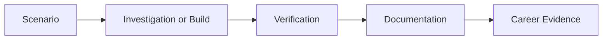

# OtherSkillsLabs Lab Output Template

Use this template for every lab in this repository. Adapt the wording to suit the topic area, but keep the evidence, production relevance, and career leverage sections.

---

# Lab Title

## 1. Lab Summary

**Lab:**
**Topic area:** Mac Apple Administration / Computer Science Foundations / Data Engineering / AWS / GCP / AI
**Difficulty:** Beginner / Intermediate / Advanced
**Status:** Not started / In progress / Completed / Blocked

### Objective

State the purpose of the lab in 2 to 4 lines.

The objective should include the technical aim, the SRE relevance, and the professional leverage aim.

---

## 2. Scenario

Briefly describe the real-world situation this lab simulates.

The scenario should include:

* the technical situation
* the person, service, or team affected
* the expected professional behaviour
* the communication challenge
* the operational or reliability concern

---

## 3. Reference Material

List the reference material used to complete the lab.

| Area | Suggested reference |
| ---- | ------------------- |
| Technical topic | |
| Vendor documentation | |
| SRE or reliability concept | |
| Career or communication layer | |

---

## 4. Requirements

| ID | Requirement | Status |
| -- | ----------- | ------ |
| R1 | | Not started |
| R2 | | Not started |
| R3 | | Not started |

Requirements should include technical requirements, evidence requirements, and at least one communication or career-evidence requirement.

---

## 5. Constraints

You must not:

* use company or private data
* publish secrets, keys, tokens, or credentials
* upload sensitive screenshots
* copy copyrighted books into the repository
* claim production experience that did not happen
* exaggerate the lab outcome
* build tools that depend on unsafe or unsanitised data

Add topic-specific constraints below.

---

## 6. Assumptions

Record assumptions here.

Examples:

* The lab uses fictional data.
* The lab is performed in a personal learning environment.
* The output is intended for portfolio and interview evidence.
* Any model, script, or application is a learning artefact, not a production system.

---

## 7. Expected Structure or Workflow

Describe the expected structure, workflow, or investigation path.

Use this section for:

* folder structure
* technical workflow
* investigation workflow
* reliability calculation workflow
* SQL or data pipeline workflow
* database design workflow
* cloud operational workflow
* AI evaluation workflow
* application workflow
* communication workflow

---

## 8. Deliverables

| File or output | Purpose |
| -------------- | ------- |
| Lab write-up | Evidence of completed work |
| Verification evidence | Proof that the work was checked |
| Model, script, dataset, dashboard, or application | Practical SRE-supporting artefact, where relevant |
| Career leverage output | Interview, CV, LinkedIn, or recruiter-facing proof |

---

## 9. Implementation Tasks

Use these tasks as a guide, not as a copy-paste tutorial.

### Task 1

### Task 2

### Task 3

Include a task for communication, interview, or branding output.

When relevant, include a task for building a small model, script, dashboard, or application.

---

## 10. Key Commands or Methods Used

| Command or method | Purpose |
| ----------------- | ------- |
| | |

For non-command labs, list the method, framework, checklist, query, prompt, model, calculation, or workflow used.

---

## 11. Files Created or Changed

| Path | Purpose |
| ---- | ------- |
| | |

---

## 12. Verification Evidence

This section proves that the lab worked.

| Check | Evidence | Result |
| ----- | -------- | ------ |
| | | Passed / Failed |

For Mac labs, include device, profile, configuration, or support evidence.

For computer science foundation labs, include calculations, examples, diagrams, or small scripts.

For data engineering labs, include input data, query results, schema checks, row counts, data quality checks, or pipeline output.

For AWS and GCP labs, include sanitised configuration, monitoring, access-control, cost, or reliability evidence.

For AI labs, include expected output versus actual output, failure cases, and limitations.

For application labs, include sample input, expected behaviour, actual behaviour, and limitations.

---

## 13. Diagram

Add a diagram only if it improves understanding.

If no diagram is needed, write:

> No diagram required for this lab.

---

## 14. Issues Encountered

| Issue | Cause | Fix |
| ----- | ----- | --- |
| | | |

If there were no issues, write:

> No major issues encountered.

---

## 15. Decisions Made

| Decision | Reason |
| -------- | ------ |
| | |

---

## 16. Security and Production Considerations

Explain the production relevance of this lab.

Cover the relevant items:

* privacy
* access control
* audit trail
* rollback or recovery
* repeatability
* reliability
* operational risk
* human approval
* evidence quality
* data quality
* backup and recovery
* cost control
* model or application limitations

---

## 17. Final Outcome

State clearly whether the lab was completed and what was proven.

---

## 18. What I Learned

Write 3 to 6 bullet points.

Include technical learning, SRE learning, and professional learning.

---

## 19. Career Leverage Output

Complete at least two of the following:

### Interview story

Write a short STAR-style answer or outline.

### Recruiter-facing summary

Write 2 to 4 lines explaining what this lab proves.

### LinkedIn or portfolio note

Write a concise post or project note.

### Conversation practice

Write a short user, manager, peer, recruiter, or community message.

---

## 20. What I Would Improve in Production

Write 2 to 5 bullet points.

---

## 21. References Used

| Reference | Used for |
| --------- | -------- |
| | |

---

## 22. Completion Checklist

* [ ] Requirements understood
* [ ] Implementation completed
* [ ] Verification evidence captured
* [ ] Issues documented
* [ ] Decisions documented
* [ ] Security considerations documented
* [ ] Diagram added if useful
* [ ] Model, script, dashboard, or application output added if relevant
* [ ] Career leverage output completed
* [ ] Reflection completed
* [ ] No secrets or private data committed

---

## 23. Reflection Questions

Answer these after completing the lab.

1. What technical skill did this lab develop?
2. What SRE problem could this help with?
3. What evidence proves the lab worked?
4. What assumptions did I make?
5. What would a stronger engineer check next?
6. How would I explain this to a non-technical user?
7. How would I explain this to a manager?
8. How would I explain this in an interview?
9. What does this lab prove about my career direction?
10. How could this become a LinkedIn or portfolio update?
11. What would make this output look more professional?
